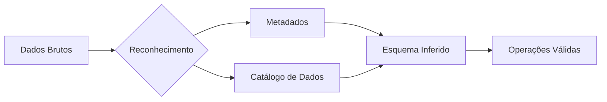

## Usando spark

**Para criar uma aplicação Spark utilizando Python, alguns passos devem ser executados antes:**

**1. Instalação do módulo pyspark:**
➤ `pip install pyspark`

**2. Importação dos módulos necessários para execução de aplicações Spark:**
➤ `from pyspark.sql import SQLContext, SparkSession`

**3. Criação da aplicação Spark:**
➤ `spark = SparkSession.builder.appName('nome da aplicação').getOrCreate()`
➤ `sql = SQLContext(spark)`

## **Coleta de dados**

- A coleta de dados é a parte das etapas dos processos ETL/ELT responsável por mapear e coletar informações utilizando algumas técnicas de extração de dados.
- Os dados coletados são armazenados num repositório com o objetivo de garantir confiabilidade, acessibilidade, disponibilidade e precisão de informações.
- Nesse cenário, devemos conhecer a origem dos dados (estão vindo de bases de dados relacionais, API's, *crawlers*, arquivos *et al*?) para definir qual a melhor estratégia para coletar o seu conteúdo.

### **Algumas das técnicas de coleta de dados são:**

* **Entrevistas:** Perguntas feitas diretamente a pessoas para obter informações detalhadas.
* **Questionários:** Formulários com perguntas estruturadas que podem ser preenchidos por respondentes.
* **Observação:** Registrar comportamentos ou fenômenos sem intervenção direta.
* **Sistemas Automatizados:** Uso de sensores ou software para captar dados automaticamente.
* **Rastreamento de Logs:** Coleta de dados sobre uso e comportamento em sistemas digitais.

**Manipulação de dados**

- A manipulação de dados é a parte das etapas dos processos ETL/ELT responsável por acessar, alterar, processar, transformar ou eliminar dados para atingir um objetivo definido. Os dados podem ser limpos e organizados para remover informações desnecessárias/redundantes, agregados, convertidos de um formato para outro e outras operações.
- É importante ter cuidado com as transformações realizadas nos dados, uma vez que podem levar usuários e sistemas a interpretações falsas ou enganosas, causando uma série de implicações de áreas de negócio.

# # **Há alguns tipos de manipulações que podemos executar em dados para que ele esteja pronto para consumo, como:**

* Limpeza de dados.
* Normalização/formatação de dados.
* Transformação de dados.

  * Codificação de caracteres.
  * Delimitador.
  * Tratamento de campos textuais.
* Filtragem de dados.
* Combinação de dados.

### **Limpeza de dados**

**A limpeza de dados é o processo de identificar e corrigir (ou remover) informações incorretas, incompletas, duplicadas ou desnecessárias de um conjunto de dados.**

**Algumas das técnicas aplicadas nesse tipo de manipulação são:**

* **Remover registros duplicados:** Se houver múltiplas entradas idênticas no conjunto de dados, é possível eliminar as cópias para evitar contagem dupla.
* **Corrigir inconsistências de entrada:** Se um mesmo campo tem diferentes formas de escrita ou abreviações, padronizá-las para garantir uniformidade.
* **Preencher valores ausentes:** Valores em branco podem ser substituídos por médias, mediana, ou valores padrão para evitar impactos negativos na análise.
* **Eliminar ou corrigir erros de entrada:** Pode-se ajustar erros de digitação ou corrigir dados mal formatados, como códigos postais ou números de telefone.

```
import pandas as pd

# Exemplo de DataFrame com dados sujos
df = pd.DataFrame({
    'nome': ['Ana', 'João', 'Maria', None, 'Ana'],
    'idade': [23, 35, None, 29, 23]
})

# Remover linhas com valores nulos
df_limpo = df.dropna()

# Remover duplicatas
df_limpo = df_limpo.drop_duplicates()

print(df_limpo)


```
Claro! Aqui está o **texto extraído da imagem**:

---

### Normalização/formatação dos dados

* A normalização envolve transformar dados brutos para que estejam em um formato consistente e padronizado. Isso facilita a análise e integração de diferentes fontes de dados. É importante conhecer o formato do dado para determinar os tipos de operações que podem ser aplicadas em seu conteúdo. Algumas técnicas são:

  – **Unificar formatos de data:** Se as datas aparecem em formatos diferentes, converter todas para um único formato padrão.
  – **Padronizar unidades de medida:** Se os dados apresentam diferentes sistemas de medida, como unidades métricas e imperiais, escolher uma unidade padrão e converter os valores.
  – **Ajustar capitalização de texto:** Uniformizar a capitalização para evitar distinções semânticas que podem impactar a análise, como deixar todo o texto em maiúsculas ou minúsculas.
  – **Remover símbolos indesejados:** Excluir ou ajustar símbolos, como vírgulas em valores numéricos, que podem impedir cálculos corretos.


```
df = pd.DataFrame({
    'nome': [' Ana ', 'JOÃO', 'maria'],
    'cidade': [' São Paulo ', 'rio de janeiro', ' CURITIBA']
})

# Remover espaços e colocar letras minúsculas
df['nome'] = df['nome'].str.strip().str.lower()
df['cidade'] = df['cidade'].str.strip().str.title()

print(df)

```

Aqui está o texto extraído da imagem:

---

### Codificação de caracteres

* A codificação de caracteres refere-se ao processo de conversão de caracteres alfabéticos, números e símbolos em uma sequência de bits que podem ser armazenados/transmitidos em sistemas computacionais. A codificação é necessária porque as informações armazenadas em um computador são representadas internamente em formato binário. Além disso, deve-se levar em consideração o alfabeto dos diversos países do mundo.

---
## Encoding

---

- Existem algumas formas de descobrir a codificação de dados, como:
  - **Verificar a documentação dos dados:** Se os dados vierem de uma fonte conhecida, é possível verificar a documentação e determinar qual é a codificação utilizada;
  - **Detecção Automática com Bibliotecas:** Utilizar bibliotecas como chardet (Python) ou ftfy para uma análise automática do encoding.
  - **Conversão e Visualização Manual:** Tentar abrir o arquivo com diferentes encodings em editores de texto avançados (ex.: Notepad++, Sublime Text) e verificar se os caracteres aparecem corretamente.
  - **Ferramentas de Linha de Comando:** Comandos como file e enca (Encoding Analyzer) no Linux podem detectar encoding de arquivos textuais.

---

### Principais métodos destacados:
1. **Documentação dos dados:** Verificação em fontes conhecidas  
2. **Bibliotecas especializadas:** Uso de ferramentas como `chardet` (Python) ou `ftfy`  
3. **Teste manual:** Experimentação com editores de texto avançados (Notepad++, Sublime Text)  
4. **Comandos Linux:** Utilização de `file` e `enca` para análise direta em terminal

```
# Detectar codificação de um arquivo
with open('arquivo_desconhecido.txt', 'rb') as f:
    dados = f.read()
    resultado = chardet.detect(dados)

print("Codificação detectada:", resultado['encoding'])
```

## Delimitador
---

- Um delimitador de dados é um caractere ou conjunto de caracteres que é usado para separar/delimitar campos em um arquivo ou num texto. É comum o uso de delimitadores em arquivos de dados que possuem comprimentos variáveis (arquivos CSV – _Comma Separated Values_ – ou TSV – _Tab Separated Values_).

- Outros delimitadores podem ser utilizados para separar dados e fica a critério do desenvolvedor/usuário, de acordo com o universo dos dados trabalhados.

---

### Pontos-chave explicados:
1. **Definição de delimitador:**  
   Caractere(s) usado(s) para separar campos em arquivos/textos  
   Exemplos comuns:  
   - CSV (`,` como separador)  
   - TSV (tabulação `\t` como separador)  

2. **Flexibilidade de uso:**  
   - Desenvolvedores podem escolher delimitadores alternativos  
   - Adequação conforme contexto dos dados  
   - Exemplos alternativos: `;`, `|`, `#`, ou sequências personalizadas  


### como achar o demilitador

- abrir o arquivo
- escolher o delimitador adequado

```
# Suponha um arquivo separado por ponto e vírgula import io

dados = io.StringIO("nome;idade\nAna;23\nJoão;35")

# Lê CSV com delimitador ";"
df = pd.read_csv(dados, delimiter=';')

print(df)

```
## Tratamento de campos extuais

- O tratamento de campos textuais é o processo de ajustar e padronizar dados textuais para melhorar a consistencia, precisao e usabilidade, principalmente em analise e integrações de dados

Segue o texto extraído da imagem, mantendo a estrutura e formatação originais:

---

- Algumas técnicas para tratamento de campos textuais envolvem:
  - **Remoção de Espaços em Branco:** Remover espaços extras no início, meio ou final do texto que podem distorcer resultados. Usar funções como `strip()`, `lstrip()`, `rstrip()` (ex.: `texto.strip()` em Python) para limpar os campos.
  - **Padronização de Capitalização:** Uniformizar o uso de maiúsculas e minúsculas para garantir consistência. Converter tudo para maiúsculas (`upper()`) ou minúsculas (`lower()`), especialmente em comparações e agrupamentos de dados.
  - **Correção Ortográfica e de Erros Comuns:** Aplicar bibliotecas de correção ortográfica (ex.: `spellchecker` em Python) ou dicionários de substituição.
  - **Tokenização de Texto:** Dividir texto em palavras ou segmentos menores para facilitar análise detalhada. Usar `split()` ou bibliotecas de NLP como `nltk` para separar palavras/frases.

---

### Resumo das técnicas:

| Técnica | Descrição | Exemplos de Implementação |
|---------|-----------|---------------------------|
| **Remoção de Espaços** | Eliminar espaços desnecessários | `strip()`, `lstrip()`, `rstrip()` |
| **Padronização de Caixa** | Uniformizar maiúsculas/minúsculas | `upper()`, `lower()`, `capitalize()` |
| **Correção Ortográfica** | Identificar e corrigir erros de escrita | Bibliotecas como `spellchecker` |
| **Tokenização** | Dividir texto em unidades menores | `split()`, `nltk.word_tokenize()` |

### Aplicações práticas:
- **Pré-processamento para NLP:** Essas técnicas são fundamentais antes de aplicar algoritmos de processamento de linguagem natural
- **Padronização de dados:** Crucial para integração de fontes heterogêneas
- **Melhoria de qualidade:** Aumenta a precisão em buscas, agregações e análises textuais
- **Redução de ruído:** Remove elementos irrelevantes que podem afetar modelos de machine learning


```
df = pd.DataFrame({
    'comentario': ['Ótimo produto!\n', ' Muito ruim :( ', 'Excelente!!' ]
})

# Remover quebras de linha, pontuação e espaços extras
df['comentario_limpo'] = (
    df['comentario']
    .str.replace(r'[^\w\s]', '', regex=True)
    .str.strip()
)

print(df)
```

```
import pandas as pd

# DataFrame corrigido
df = pd.DataFrame({
    'nome': ['Ana', 'João', 'Maria'],
    'idade': [23, 35, 29]
})

# Filtro aplicado corretamente
filtrado = df[df['idade'] > 30]

print(filtrado)
```

Segue o texto extraído da imagem, mantendo a formatação e estrutura originais:

---

**# Mecanismos de inferência e correção de tipagem de dados**

- A etapa de reconhecimento das informações tem por objetivo mapear o domínio dos atributos (tipo, estrutura, nome de colunas) para determinar os tipos de operações que podem ser realizadas nos dados.
- Algumas técnicas para reconhecer os dados podem envolver a leitura dos metadados dos arquivos (estruturas que descrevem a conteúdo de um objeto).
- Também é possível armazenar as informações de um arquivo/tabela num catálogo de dados.

---

### Conceitos-chave explicados:

1. **Objetivo do reconhecimento de informações:**  
   Mapear características dos atributos para determinar operações válidas  
   - Tipos de dados (inteiro, string, data, etc.)  
   - Estrutura dos campos  
   - Nomes das colunas  

2. **Técnicas de reconhecimento:**  
   - **Leitura de metadados:** Extrair informações descritivas embutidas nos arquivos  
     *Exemplo: schema de bancos de dados, headers de arquivos Parquet/AVRO*  
   - **Catálogos de dados:** Armazenar informações sobre datasets em repositórios centralizados  
     *Exemplo: AWS Glue Data Catalog, Apache Atlas*  

3. **Aplicações práticas:**  
   - Inferência automática de tipos durante ingestão de dados  
   - Validação de esquemas em pipelines ETL  
   - Documentação automática de datasets  
   - Detecção de incompatibilidades entre sistemas  

### Fluxo típico de inferência de tipos:


### OBS


- campos float nao tem precisão definida ele armazena o maximo que ele aguentar
- Caso os dados nao sejam reconhecidos (o tipo deles) nos podemos modificar o tipo do dado atraves de uma atribução , fornecer um schema de dados ou inferir o tipo de dado baseado n uma amostra de seu conteudo

## Duvidas 

- quando tratar e quando dropar dados , principalmente em relação a faltando  de dados


# Normalização de dados


- A normalização de dados e o processo de organizacao de dados em que o objetivo e o estabelecimento de vinculos entre tabelas (ou arquivos) de acordo com as regras projetadas para tornar o sistema mais flexivel, integro, eliminar a redundancia e a dependencia indireta das informacoes.
- Dados redundantes aumentam a utilizacao de disco e criam problemas de manutencao. Se os dados existem em mais de um lugar, eles devem ser alterados exatamente da mesma maneira em todos os locais, dificultando a organizacao.
- Dependencia indireta pode causar problemas na analise de informacoes quando nao e possivel afirmar, com confianca, a associaqao entre registros ou cruzamento de dados que nao fazem associaqao direta com uma entidade (objeto) conhecida.
- 1N = Valores atomicos (um campo nao pode ter mais de um significado e cada linha deve ter uma chave primeira unica) ex coluna telefone se o individuo tiver vairios telefones
- 2N = dependencia completa (os atributos tem que estar depende do TODAS AS CHAVES PRIMARIAS )
- 3N = Sem dependencia transitiva


